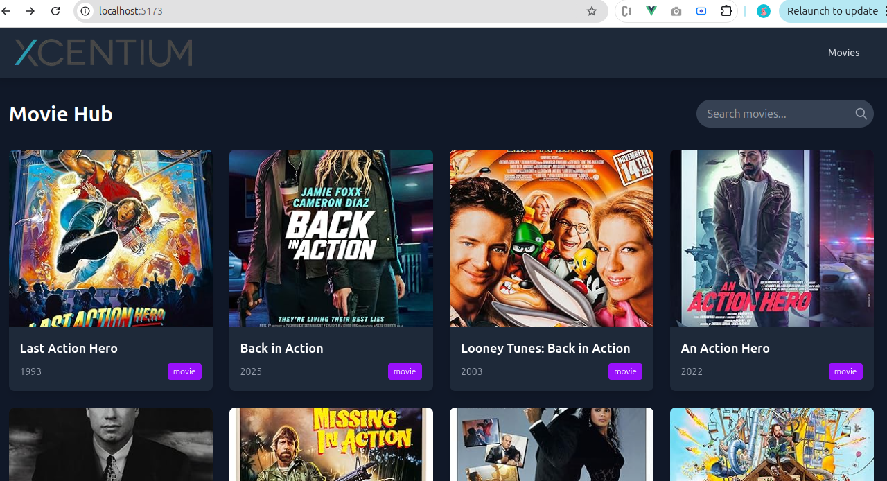
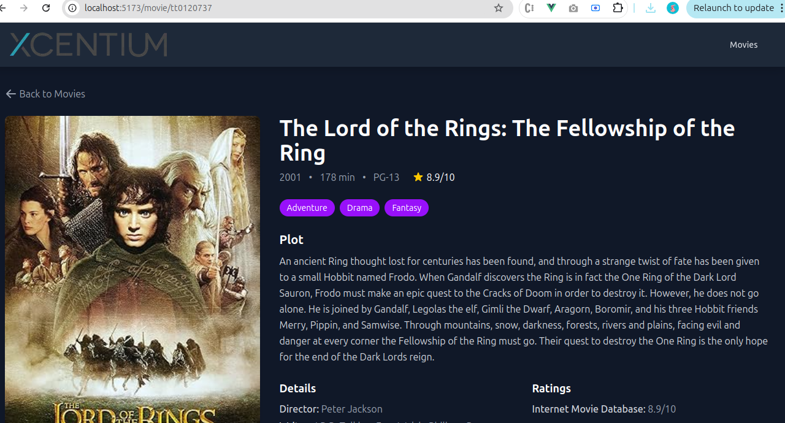

# Xcentium Movie Hub - Vue 3 Movie Discovery App





## Overview

Xcentium Movie Hub is a modern movie discovery application built with Vue 3, TypeScript, and Tailwind CSS. It allows users to browse movies, view details, and search through a vast collection of films powered by the OMDb API.

## Features

- 🎬 Browse popular movies
- 🔍 Search functionality with debouncing
- 📱 Fully responsive design
- ⚡ Fast loading with lazy image loading
- 🎨 Beautiful UI with Tailwind CSS
- 🛠 TypeScript support for type safety
- 📱 Mobile-first design
- 🔄 State management with Pinia

## Technologies Used

- Vue 3 (Composition API)
- TypeScript
- Pinia (State Management)
- Vue Router
- Tailwind CSS
- Axios (HTTP Client)
- Vite (Build Tool)

## Project Structure

```
src/
├── assets/          # Static assets
├── components/      # Reusable components
│   ├── MovieCard.vue
│   ├── MovieSearch.vue
│   ├── MovieBackButton.vue
│   ├── MoviePoster.vue
│   ├── MovieHeader.vue
│   ├── MovieDetailsSection.vue
│   ├── LoadingSpinner.vue
│   └── ErrorDisplay.vue
├── router/          # Routing configuration
├── stores/          # Pinia stores
├── views/           # Page components
│   ├── HomeView.vue
│   └── MovieDetail.vue
├── App.vue          # Main app component
└── main.ts          # App entry point
```

## Setup Instructions

### 1. Clone the repository

```bash
git clone https://github.com/PareshLalvani/Xcentium-Movie-Hub.git
cd Xcentium-Movie-Hub
```

### 2. Install dependencies

```bash
npm install
```

### 3. Create environment variables

Create a `.env` file in the root directory:

```env
VITE_OMDB_API_KEY=your_api_key_here
VITE_OMDB_BASE_URL=https://www.omdbapi.com/
```

Get your free API key from [OMDb API](http://www.omdbapi.com/apikey.aspx).

### 4. Run the development server

```bash
npm run dev
```

### 5. Build for production

```bash
npm run build
```

### 6. Preview production build

```bash
npm run preview
```

## Acknowledgments

- OMDb API for providing movie data
- Vue.js and Vite teams for amazing tools
- Tailwind CSS for utility-first styling